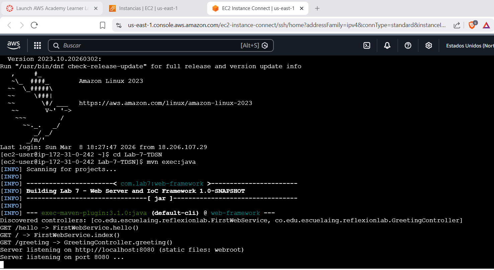
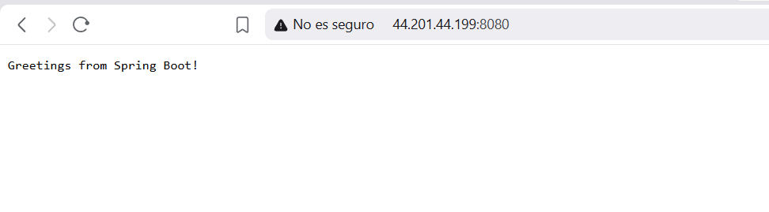
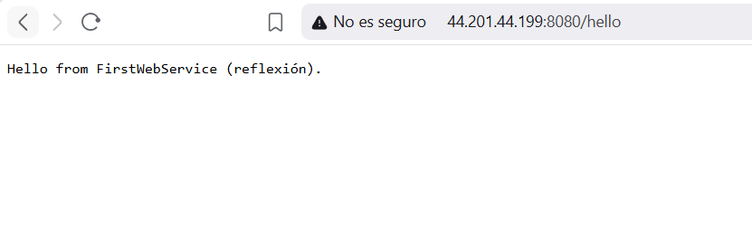
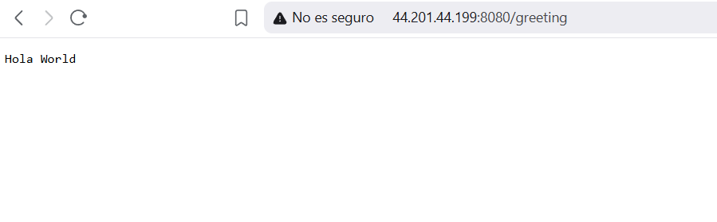
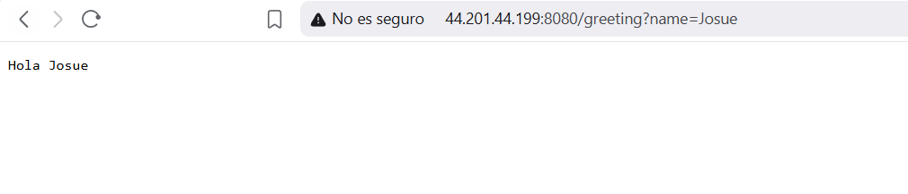

# Lab 7 – Web Server and IoC Framework
## By Josué Hernandez
A minimal Java web server (Apache-style) that serves HTML and PNG files and provides a reflection-based IoC framework to build web applications from POJOs. The server handles multiple requests sequentially (non-concurrent).

## Features

- **Static files**: Serves HTML, PNG, CSS, JS from `src/main/resources/webroot/`.
- **REST from POJOs**: Controllers are plain Java classes annotated with `@RestController`. Methods annotated with `@GetMapping` are exposed as GET endpoints (return type `String`).
- **Query parameters**: `@RequestParam(value = "name", defaultValue = "World")` binds query parameters to method arguments.
- **Two ways to load controllers**:
  1. **Command line**: Pass controller class name(s) as arguments.
  2. **Classpath scanning**: With no arguments, the framework scans the package `co.edu.escuelaing.reflexionlab` for all `@RestController` classes and registers them.

## Requirements

- Java 11+
- Maven 3.x

## Build

```bash
mvn clean compile
```

## Run

**Classpath scanning (all `@RestController` in the package):**

```bash
mvn exec:java
```

The server listens on **http://localhost:8080**.

## Example endpoints 

| URL | Description |
|-----|-------------|
| `/` | Greetings from Spring Boot! |
| `/hello` | Hello from FirstWebService |
| `/greeting` | Hola World (default) |
| `/greeting?name=YourName` | Hola YourName |
| `/index.html` | Static HTML from webroot |

## AWS deployment (evidence)

### Deployment screenshots

**EC2 instance – server running (Amazon Linux, `mvn exec:java`):**



**Root endpoint (`/`) – Greetings from Spring Boot:**



**Static page – Web Framework Demo (`/index.html`):**


**FirstWebService – `/hello`:**



**GreetingController – `/greeting` (default):**



**GreetingController – `/greeting?name=Josue`:**



