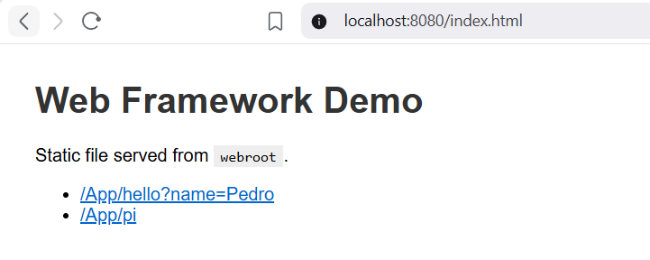
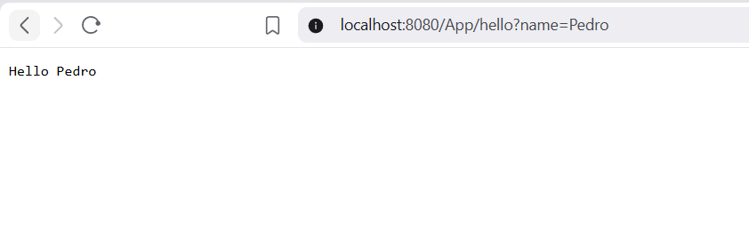
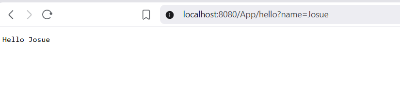
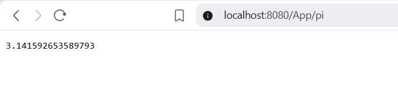
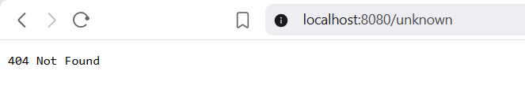

# Web Framework for REST Services and Static Files (Lab 7 – Reflexión / IoC)
## By: Josué Hernandez
A lightweight Java web framework that extends a simple HTTP server with **GET REST routes** (using lambda handlers), **query parameter extraction**, and **static file serving** (HTML, PNG, etc.). Incluye un **framework IoC mínimo** que usa **reflexión** para cargar un POJO desde la línea de comandos y publicar servicios a partir de anotaciones `@RestController` y `@GetMapping`.

## Features

- **GET routes**: Register REST endpoints with `get(path, (req, res) -> body)`.
- **Query parameters**: Access query values in handlers via `req.getValues("name")`.
- **Static files**: Serve HTML, CSS, JS, PNG and other images from `webroot`.
- **MicroSpringBoot (Lab 7)**: Carga un POJO por reflexión; publica métodos anotados con `@GetMapping` (retorno `String`) en las URIs indicadas. Servidor **no concurrente** (una solicitud a la vez).

## Project Structure

```
Lab-7-TDSN/
├── pom.xml
├── README.md
├── img/
└── src/
    ├── main/
    │   ├── java/
    │   │   ├── com/lab6/
    │   │   │   ├── Application.java
    │   │   │   ├── WebFramework.java
    │   │   │   └── http/
    │   │   │       ├── Request.java
    │   │   │       ├── Response.java
    │   │   │       └── RouteHandler.java
    │   │   └── co/edu/escuelaing/reflexionlab/
    │   │       ├── MicroSpringBoot.java    ← Punto de entrada IoC
    │   │       ├── RestController.java     ← Anotación
    │   │       ├── GetMapping.java         ← Anotación
    │   │       └── FirstWebService.java    ← POJO de ejemplo
    │   └── resources/
    │       └── webroot/
    │           ├── index.html
    │           └── style.css
    └── test/
        └── java/com/lab6/
            └── RequestTest.java
```

## Requirements

- Java 11+
- Maven 3.x

## Build and Run

### Servidor clásico (rutas registradas a mano)

```bash
mvn clean compile
mvn exec:java
```

### Servidor con IoC por reflexión (Lab 7 – MicroSpringBoot)

Se pasa la clase del POJO (controlador) como argumento. El framework descubre por reflexión los métodos anotados con `@GetMapping` y los publica en la URI indicada (solo retorno `String`).

```bash
mvn clean compile
java -cp target/classes co.edu.escuelaing.reflexionlab.MicroSpringBoot co.edu.escuelaing.reflexionlab.FirstWebService
```

O con Maven (ejecución `micro-spring-boot`):

```bash
mvn clean compile exec:java@micro-spring-boot
```

En esta modalidad el servidor sirve:

- **Rutas del POJO**: `/` → "Greetings from Spring Boot!", `/hello` → mensaje de FirstWebService.
- **Archivos estáticos**: `webroot` (p. ej. `/index.html`, imágenes PNG en `webroot`).

### Manual tests (screenshots)

1. **Static file – index.html**  
   URL: `http://localhost:8080/index.html`  
   The page loads with the demo title and links to the REST endpoints.

   

2. **REST GET with query – hello (name=Pedro)**  
   URL: `http://localhost:8080/App/hello?name=Pedro`  
   Response: `Hello Pedro`.

   

3. **REST GET with query – hello (name=Josue)**  
   URL: `http://localhost:8080/App/hello?name=Josue`  
   Response: `Hello Josue`.

   

4. **REST GET – /App/pi**  
   URL: `http://localhost:8080/App/pi`  
   Response: value of π (e.g. `3.141592653589793`).

   

Additional manual check: `http://localhost:8080/unknown` returns 404 Not Found.
   
